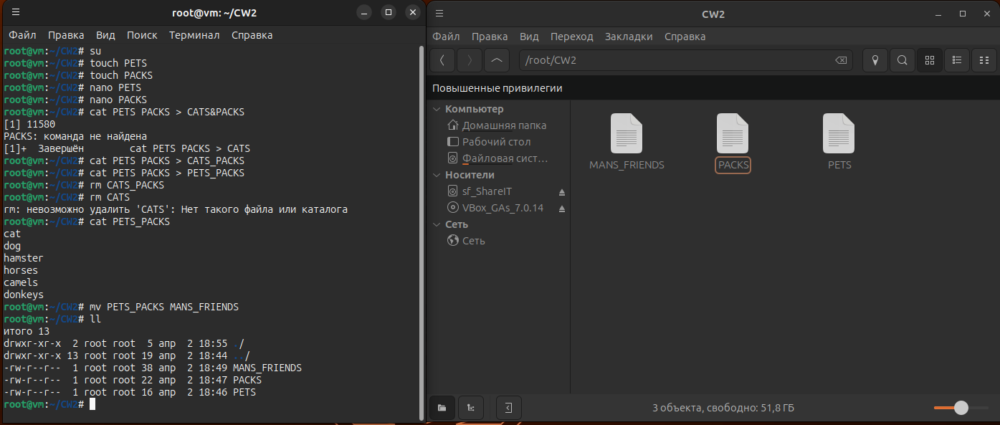
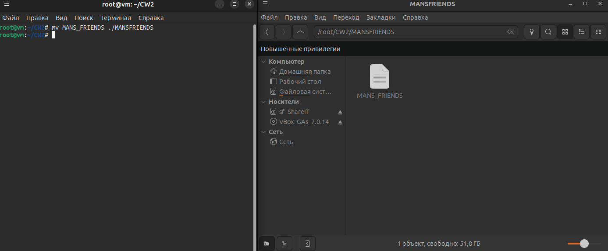
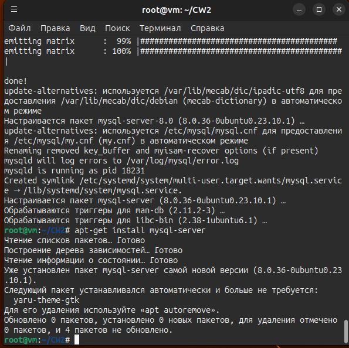
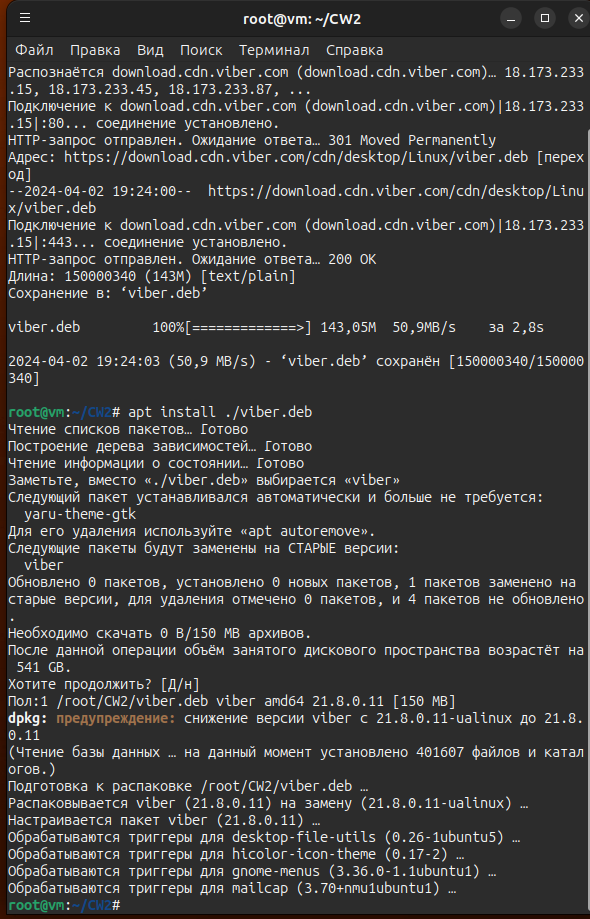
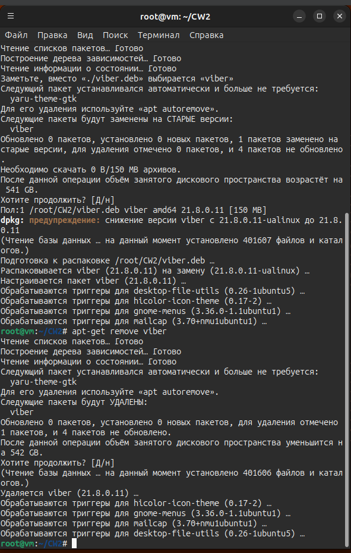
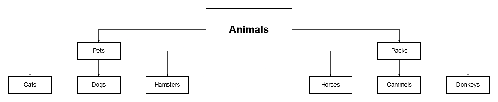

# Итоговая контрольная работа

## Операционные системы и виртуализация (Linux)

<u>**1. Использование команды cat в Linux**</u>

<u>**2. Работа с директориями в Linux**</u>

<u>**3. Работа с MySQL в Linux.**</u>

<u>**4. Управление deb-пакетами**</u>

 ## Работа с MySQL 

[sql](Registry.sql)

## Объектно-ориентированное программирование 

<u>**1. Диаграмма классов**</u>

<u>**2. ООП и Java**</u>

[OOP&JAVA](https://github.com/Oleg-Skalskiy/CW-Itog/tree/bd69e0ba7d788ecd8bcc26bb2ae734239e4cc3ec/src)

